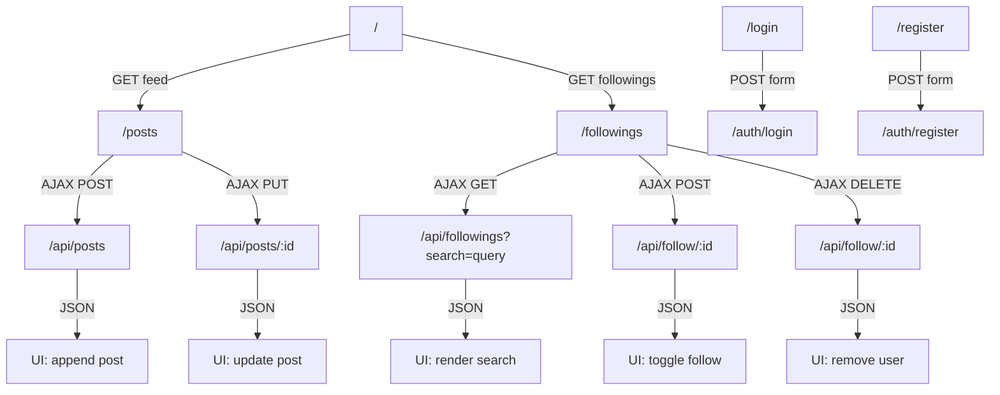

---

# Use case

### 1. Xác thực(Login)

| **Tên Use Case** | **Tác nhân** | **Mô tả tóm tắt** | **Luồng đi (Flow)** |
| --- | --- | --- | --- |
| **Đăng nhập** | Người dùng | người dùng đăng nhập vào web | Truy cập vào `/login`  → nhập thông tin đăng nhập → chuyển trang đến `/`  |
| **Đăng kí** | Người dùng | Đăng kí tài khoảng vào web | Truy cập vào `/register`  → nhập thông tin đăng kí tài khoảng |

---

### 2. Quản lý Bài viết (Posts)

| **Tên Use Case** | **Tác nhân** | **Mô tả tóm tắt** | **Luồng đi (Flow)** |
| --- | --- | --- | --- |
| **Xem bảng tin (Feed)** | Người dùng | Xem danh sách các bài viết mới nhất trên hệ thống. | Truy cập trang chủ **`/`** →  Hệ thống tải danh sách bài viết. |
| **Đăng bài viết mới** | Người dùng | Tạo và chia sẻ nội dung mới lên hệ thống. | Tại trang chủ → Nhấn nút "Đăng bài" → Chuyển đến **`/post`** → Nhập nội dung → Gửi. |
| **Xem bài viết của User cụ thể** | Người dùng | Xem tất cả các bài viết của một người mà mình đang follow. | Vào **`/followings`** → Nhấn vào một Follower cụ thể → Hệ thống lọc bài viết của người đó. |
| **Sửa bài viết** | Người dùng (Tác giả bài viết) | Cập nhật lại nội dung bài viết đã đăng của chính mình. | Tại Trang chủ **`/`** (hoặc trang cá nhân) → Ở bài viết của mình, nhấn nút/icon "Sửa" → Chuyển đến form sửa (vd: **`/post/edit/{id}`** hoặc mở Popup form) → Nội dung cũ hiện ra → Chỉnh sửa → Nhấn "Lưu" → Quay lại xem bài viết đã cập nhật |

---

### 3. Tương tác & Theo dõi (Social/Following)

| **Tên Use Case** | **Tác nhân** | **Mô tả tóm tắt** | **Luồng đi (Flow)** |
| --- | --- | --- | --- |
| **Quản lý danh sách Follow** | Người dùng | Xem danh sách những người mình đang theo dõi. | Truy cập vào đường dẫn **`/followings`**. |
| **Tìm kiếm người dùng** | Người dùng | Tìm kiếm bạn bè hoặc người dùng khác bằng tên/ID. | Tại trang chủ hoặc trang Follow → Nhập từ khóa vào form tìm kiếm →  Chuyển đến **`/followings?search={query}`**. |
| **Thực hiện Follow** | Người dùng | Bắt đầu theo dõi một người dùng mới từ kết quả tìm kiếm. | Tại trang kết quả tìm kiếm →  Nhấn nút "Follow" bên cạnh tên User đó. |
| **Bỏ theo dõi (Unfollow)** | Người dùng | Hủy theo dõi một người dùng đã follow trước đó để không xem bài viết của họ nữa. | Từ Trang chủ chuyển đến **`/followings`** →Tìm người dùng trong danh sách đang hiển thị → Nhấn nút "Bỏ theo dõi" bên cạnh tên → Cập nhật lại danh sách (người đó biến mất). |

---

# Luồng định tuyến giữa các endpoint

---